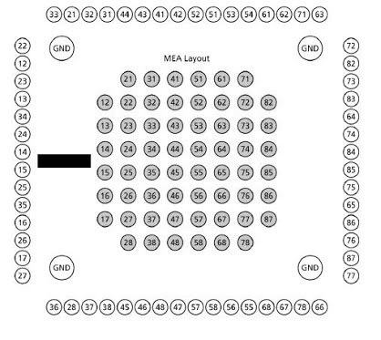

# spike-analysis

Repository for the results of the spike sorting and custom scripts used for the analysis post sorting.
The recordings were done using a 60 electrode MEA from Multi-Channle systems using a MEA-1060-Inv-BC.

The spike sorting was done using Spyking-Circus [https://github.com/spyking-circus/spyking-circus]. 
